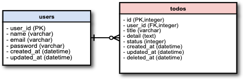

## 概要
PHPで作成したTodoリストです。

## 機能
- 新規会員登録
- ログイン
- ログアウト
- Todoリスト一覧表示
- Todoリストの新規作成
- Todoリストの編集
- Todoリストの削除

## ページ一覧
- 新規会員登録
views/register/signup.php
- ログインページ
views/login/index.php
- Todo一覧画面
views/todo/top.php
- Todo新規作成画面
views/todo/new.php
- Todo詳細画面
views/todo/detail.php
- Todo編集画面
/views/todo/edit.php

## DB一覧
- users:登録ユーザを管理
- todos:Todoを管理

